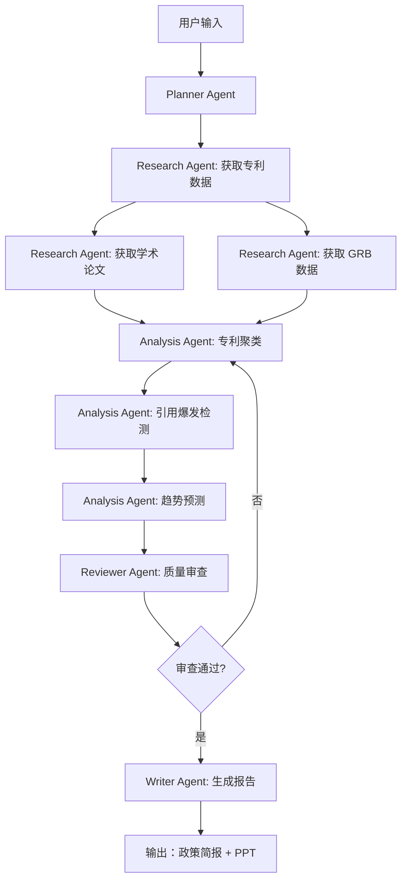

# 专利分析与科技预测多代理系统设计文档

> **版本**: v1.0
> **日期**: 2026-01-21
> **目的**: 以政策分析与科技预测、决策支援为目标的企业级 AI 多代理系统

---

## 一、系统概览

### 1.1 核心目标

本系统旨在通过多代理协作（Multi-Agent Systems）实现：

- **专利技术趋势分析**：从大规模专利数据中识别技术演进轨迹
- **学术前沿追踪**：分析学术论文网络，预测研究热点
- **政策决策支援**：结合 GRB（政府研究预算）数据，提供科技政策建议
- **知识图谱构建**：建立跨领域技术关联网络

### 1.2 设计原则

1. **模块化解耦**：MCP 协议统一数据接入，Skills 原子化能力封装
2. **可扩展性**：Agent 角色可动态增减，Skills 可插拔
3. **可审计性**：所有决策过程可追溯，符合政策制定透明度要求
4. **协作优先**：Agent 间通过协商与反馈机制提升输出质量

---

## 二、系统架构

### 2.1 三层架构设计

```
┌─────────────────────────────────────────────────────────────┐
│                     Cowork Layer (协作层)                     │
│  ┌─────────┐  ┌─────────┐  ┌─────────┐  ┌─────────┐        │
│  │ Planner │  │Research │  │Analysis │  │Reviewer │ Writer │
│  │  Agent  │→ │ Agent   │→ │ Agent   │→ │ Agent   │→Agent │
│  └─────────┘  └─────────┘  └─────────┘  └─────────┘        │
│       ↓            ↓            ↓            ↓               │
├─────────────────────────────────────────────────────────────┤
│                    Skills Layer (技能层)                      │
│  ┌──────────────┐  ┌──────────────┐  ┌──────────────┐      │
│  │Patent        │  │Citation      │  │Trend         │      │
│  │Clustering    │  │Analysis      │  │Forecasting   │ ...  │
│  └──────────────┘  └──────────────┘  └──────────────┘      │
│       ↓                  ↓                  ↓               │
├─────────────────────────────────────────────────────────────┤
│                    MCP Layer (数据接入层)                     │
│  ┌──────────┐  ┌──────────┐  ┌──────────┐  ┌──────────┐   │
│  │ Patent   │  │ Academic │  │   GRB    │  │  News    │   │
│  │   DB     │  │  Papers  │  │ Database │  │  APIs    │   │
│  └──────────┘  └──────────┘  └──────────┘  └──────────┘   │
└─────────────────────────────────────────────────────────────┘
```

### 2.2 数据流向

1. **任务输入** → Planner Agent（任务分解）
2. **数据获取** → Research Agent 通过 MCP 访问数据源
3. **分析处理** → Analysis Agent 调用 Skills 进行计算
4. **质量控制** → Reviewer Agent 验证结论有效性
5. **成果输出** → Writer Agent 生成政策简报/学术报告

---

## 三、Agent 角色定义

### 3.1 Planner Agent（规划者）

**职责**：
- 接收用户需求（自然语言或结构化查询）
- 将复杂任务分解为子任务序列
- 分配任务给下游 Agent
- 监控整体进度与资源使用

**输入示例**：
```json
{
  "task": "分析 2020-2025 年人工智能芯片专利趋势",
  "scope": ["US", "CN", "EP"],
  "output_format": "policy_brief"
}
```

**输出示例**：
```json
{
  "subtasks": [
    {
      "id": "task_001",
      "agent": "Research",
      "action": "fetch_patents",
      "params": {"ipc": "G06N", "date_range": "2020-2025"}
    },
    {
      "id": "task_002",
      "agent": "Analysis",
      "action": "cluster_by_technology",
      "depends_on": ["task_001"]
    }
  ]
}
```

**关键 Skills**：
- TaskDecompositionSkill
- DependencyGraphSkill
- ResourceEstimationSkill

---

### 3.2 Research Agent（研究者）

**职责**：
- 通过 MCP 接入多源异构数据
- 数据预处理与质量验证
- 构建初步数据集（专利、论文、政策文件）

**MCP 数据源**：
- Patent MCP：USPTO, EPO, CNIPA, WIPO
- Academic MCP：PubMed, arXiv, IEEE Xplore
- GRB MCP：政府研究预算数据库
- News MCP：科技新闻 API（如 NewsAPI）

**输入示例**：
```json
{
  "task_id": "task_001",
  "query": {
    "type": "patent",
    "filters": {
      "ipc": ["G06N3", "H01L"],
      "countries": ["US", "CN"],
      "date_range": "2020-2025"
    }
  }
}
```

**输出示例**：
```json
{
  "dataset_id": "ds_20260121_001",
  "records": 12453,
  "fields": ["patent_id", "title", "abstract", "ipc", "citations"],
  "quality_score": 0.94,
  "storage_path": "mcp://patent_db/ds_20260121_001"
}
```

**关键 Skills**：
- DataFetchSkill（支持多源）
- DataCleaningSkill
- DataValidationSkill

---

### 3.3 Analysis Agent（分析者）

**职责**：
- 调用专业分析 Skills 进行深度计算
- 技术聚类、趋势预测、网络分析
- 生成中间分析结果与可视化数据

**核心分析流程**：
1. 专利聚类（技术主题识别）
2. 引用网络分析（技术演进路径）
3. 时间序列预测（趋势外推）
4. 跨领域关联发现

**输入示例**：
```json
{
  "task_id": "task_002",
  "dataset_id": "ds_20260121_001",
  "analysis_type": "cluster",
  "params": {
    "method": "hierarchical",
    "features": ["ipc", "abstract_embedding"]
  }
}
```

**输出示例**：
```json
{
  "clusters": [
    {
      "cluster_id": "C01",
      "label": "神经网络硬件加速",
      "size": 3421,
      "key_patents": ["US2023XXXXX", "CN2024XXXXX"],
      "growth_rate": 0.34
    },
    {
      "cluster_id": "C02",
      "label": "光子计算芯片",
      "size": 1256,
      "growth_rate": 0.78
    }
  ],
  "visualization": "mcp://storage/cluster_viz.json"
}
```

**关键 Skills**：
- PatentClusteringSkill
- CitationNetworkSkill
- TrendForecastingSkill
- CrossDomainMappingSkill
- WordFrequencySkill（利用现有 WordFreq.js 模块）

---

### 3.4 Reviewer Agent（审查者）

**职责**：
- 验证分析方法的科学性
- 检查数据偏差与异常值
- 评估结论的可信度与政策相关性
- 提出改进建议或要求重新分析

**审查维度**：
1. **方法论审查**：聚类算法是否适用于该数据特征
2. **数据质量审查**：样本量是否充足、数据是否有偏
3. **逻辑审查**：结论是否过度推断
4. **政策适用性审查**：对政策制定的实际价值

**输入示例**：
```json
{
  "task_id": "task_002",
  "analysis_results": { /* Analysis Agent 输出 */ },
  "review_criteria": ["methodology", "data_quality", "policy_relevance"]
}
```

**输出示例**：
```json
{
  "review_id": "rev_001",
  "status": "approved_with_notes",
  "findings": [
    {
      "type": "warning",
      "message": "聚类 C02 样本量偏小，建议扩大时间范围",
      "severity": "medium"
    }
  ],
  "confidence_score": 0.87,
  "recommendations": [
    "补充 2018-2019 年数据以增强 C02 聚类可信度"
  ]
}
```

**关键 Skills**：
- MethodologyValidationSkill
- BiasDetectionSkill
- ConfidenceEstimationSkill

---

### 3.5 Writer Agent（撰写者）

**职责**：
- 将分析结果转化为结构化报告
- 根据受众调整叙事方式（政策简报 vs 学术报告）
- 生成可视化图表与摘要

**输出格式**：
- **政策简报**（Policy Brief）：2-4 页，非技术语言
- **技术报告**（Technical Report）：完整方法论与数据附录
- **演示文稿**（Presentation）：PowerPoint，适合决策层

**输入示例**：
```json
{
  "task_id": "task_final",
  "analysis_results": { /* 审查通过的分析结果 */ },
  "format": "policy_brief",
  "audience": "government_policymakers",
  "language": "zh-TW"
}
```

**输出示例**：
```json
{
  "document_id": "doc_20260121_001",
  "title": "人工智能芯片专利趋势分析与政策建议",
  "sections": [
    {
      "title": "执行摘要",
      "content": "2020-2025 年间，AI 芯片专利申请量年均增长 34%..."
    },
    {
      "title": "关键发现",
      "content": "光子计算芯片成为新兴热点，年增长率达 78%..."
    },
    {
      "title": "政策建议",
      "content": "1. 加大光子计算领域研发投入\n2. ..."
    }
  ],
  "attachments": ["cluster_viz.png", "trend_chart.png"],
  "output_path": "mcp://storage/reports/doc_20260121_001.pdf"
}
```

**关键 Skills**：
- NarrativeGenerationSkill
- VisualizationSkill
- PolicyFramingSkill
- PresentationGenerationSkill（使用 pptx skill）

---

## 四、Skills 清单与接口规格

### 4.1 数据获取类 Skills

#### DataFetchSkill
```yaml
name: DataFetchSkill
description: 通过 MCP 从多源获取数据
input:
  - source: string (patent_db / academic_db / grb_db)
  - query: object (查询参数)
  - limit: integer (最大返回数)
output:
  - dataset_id: string
  - records: array
  - metadata: object
mcp_dependencies:
  - patent_mcp
  - academic_mcp
```

#### DataCleaningSkill
```yaml
name: DataCleaningSkill
description: 清洗与标准化数据
input:
  - dataset_id: string
  - cleaning_rules: array
output:
  - cleaned_dataset_id: string
  - removed_records: integer
  - quality_report: object
```

---

### 4.2 分析类 Skills

#### PatentClusteringSkill
```yaml
name: PatentClusteringSkill
description: 专利技术聚类分析
input:
  - dataset_id: string
  - method: string (kmeans / hierarchical / dbscan)
  - features: array (ipc / embeddings / citations)
  - num_clusters: integer (可选)
output:
  - clusters: array
    - cluster_id: string
    - label: string
    - size: integer
    - representative_patents: array
  - silhouette_score: float
algorithm:
  - 使用 IPC 分类 + abstract embeddings (multilingual-e5)
  - 层次聚类法，自动确定最优聚类数
```

#### CitationBurstDetectionSkill
```yaml
name: CitationBurstDetectionSkill
description: 检测突发引用技术（技术爆发点）
input:
  - dataset_id: string
  - time_window: integer (月为单位)
output:
  - burst_technologies: array
    - technology: string
    - burst_start: date
    - burst_intensity: float
algorithm:
  - 使用 Kleinberg's burst detection 算法
  - 识别引用量异常增长的专利族
```

#### TrendForecastingSkill
```yaml
name: TrendForecastingSkill
description: 技术趋势预测
input:
  - time_series_data: array
  - forecast_horizon: integer (月数)
  - model: string (arima / prophet / lstm)
output:
  - forecast: array
    - date: string
    - predicted_value: float
    - confidence_interval: [lower, upper]
  - trend_direction: string (up / down / stable)
```

#### CrossDomainMappingSkill
```yaml
name: CrossDomainMappingSkill
description: 跨领域技术关联分析
input:
  - source_domain: string (IPC 主分类)
  - target_domain: string
  - dataset_id: string
output:
  - connections: array
    - source_tech: string
    - target_tech: string
    - connection_strength: float
    - evidence_patents: array
algorithm:
  - 共同引用分析（co-citation）
  - 发明人流动分析
  - 技术组合分析（IPC 共现）
```

#### WordFrequencySkill
```yaml
name: WordFrequencySkill
description: 词频与共现分析（基于现有 WordFreq.js 模块）
input:
  - texts: array (专利摘要/claims)
  - mode: string (single_word / two_word_cooccurrence)
  - top_n: integer
output:
  - word_frequencies: array
    - word: string
    - frequency: integer
  - cooccurrence_network: array (if mode = two_word)
integration:
  - 包装现有 WordFreq.js 模块
  - 用于生成 Tag Cloud 和社会网络分析图
```

---

### 4.3 审查类 Skills

#### BiasDetectionSkill
```yaml
name: BiasDetectionSkill
description: 检测数据偏差
input:
  - dataset_id: string
  - bias_types: array (geography / temporal / citation)
output:
  - bias_report: object
    - detected_biases: array
    - severity: string (low / medium / high)
    - recommendations: array
```

#### ConfidenceEstimationSkill
```yaml
name: ConfidenceEstimationSkill
description: 估算分析结果可信度
input:
  - analysis_results: object
  - evidence_strength: array
output:
  - confidence_score: float (0-1)
  - uncertainty_sources: array
```

---

### 4.4 输出类 Skills

#### PolicyFramingSkill
```yaml
name: PolicyFramingSkill
description: 将技术分析转化为政策建议
input:
  - analysis_results: object
  - policy_context: string (国家科技政策背景)
output:
  - policy_recommendations: array
    - recommendation: string
    - rationale: string
    - priority: string (high / medium / low)
    - timeframe: string (short / medium / long-term)
```

#### PresentationGenerationSkill
```yaml
name: PresentationGenerationSkill
description: 生成 PowerPoint 演示文稿
input:
  - content: object (标题、图表、结论)
  - template: string (可选)
  - language: string
output:
  - pptx_file: string (文件路径)
dependencies:
  - pptx skill (已安装)
implementation:
  - 使用 html2pptx workflow
  - 支持自定义配色方案与布局
```

---

## 五、MCP 数据源配置规格

### 5.1 Patent MCP

**数据源**：
- USPTO (美国专利商标局)
- EPO (欧洲专利局)
- CNIPA (中国国家知识产权局)
- WIPO (世界知识产权组织)

**接口规格**：
```yaml
mcp_id: patent_mcp
endpoint: mcp://patent_db
authentication: api_key
capabilities:
  - search_by_ipc
  - search_by_keywords
  - get_citations
  - get_legal_status
data_fields:
  - patent_id: string (唯一标识符)
  - title: string
  - abstract: string
  - claims: array
  - ipc_codes: array
  - filing_date: date
  - publication_date: date
  - applicants: array
  - inventors: array
  - citations_backward: array (引用的专利)
  - citations_forward: array (被引用的专利)
rate_limits:
  - requests_per_minute: 60
  - max_results_per_query: 10000
```

---

### 5.2 Academic MCP

**数据源**：
- PubMed (生物医学)
- arXiv (物理、计算机科学)
- IEEE Xplore (工程技术)
- Scopus / Web of Science (综合)

**接口规格**：
```yaml
mcp_id: academic_mcp
endpoint: mcp://academic_db
authentication: institutional_access
capabilities:
  - search_by_keywords
  - get_citations
  - get_author_profile
data_fields:
  - paper_id: string
  - title: string
  - abstract: string
  - authors: array
  - publication_date: date
  - journal: string
  - citations: array
  - keywords: array
rate_limits:
  - requests_per_minute: 30
```

---

### 5.3 GRB MCP (政府研究预算数据库)

**数据源**：
- 国家科技预算数据
- 研究项目资助记录
- 科技政策文档

**接口规格**：
```yaml
mcp_id: grb_mcp
endpoint: mcp://grb_database
authentication: government_credential
capabilities:
  - search_by_program
  - search_by_institution
  - get_funding_trends
data_fields:
  - project_id: string
  - title: string
  - abstract: string
  - funding_amount: float
  - funding_agency: string
  - start_date: date
  - end_date: date
  - research_areas: array (对应学科分类)
  - outputs: array (专利、论文等)
privacy:
  - 敏感信息脱敏处理
  - 仅提供聚合统计数据（个别项目需授权）
```

---

### 5.4 News MCP

**数据源**：
- 科技新闻 API (NewsAPI, Google News)
- 产业报告 (Gartner, IDC)

**接口规格**：
```yaml
mcp_id: news_mcp
endpoint: mcp://news_api
authentication: api_key
capabilities:
  - search_by_keywords
  - search_by_date_range
  - get_trending_topics
data_fields:
  - article_id: string
  - title: string
  - content: string
  - source: string
  - publication_date: date
  - sentiment: float (-1 to 1)
```

---

## 六、Cowork 协作机制

### 6.1 任务流编排（Workflow Orchestration）

**示例：人工智能芯片趋势分析任务**



### 6.2 Agent 间通信协议

**消息格式**：
```json
{
  "message_id": "msg_20260121_001",
  "from_agent": "Analysis",
  "to_agent": "Reviewer",
  "message_type": "analysis_complete",
  "timestamp": "2026-01-21T14:32:00Z",
  "payload": {
    "task_id": "task_002",
    "results": { /* 分析结果 */ },
    "confidence": 0.87
  },
  "requires_response": true,
  "priority": "high"
}
```

**响应格式**：
```json
{
  "message_id": "msg_20260121_002",
  "in_reply_to": "msg_20260121_001",
  "from_agent": "Reviewer",
  "to_agent": "Analysis",
  "message_type": "review_feedback",
  "payload": {
    "status": "approved_with_notes",
    "notes": ["建议补充 2018-2019 数据"],
    "confidence_assessment": 0.85
  }
}
```

### 6.3 冲突解决机制

**场景 1**：Reviewer 要求重新分析

```yaml
conflict_type: quality_threshold_not_met
resolution_strategy:
  - Reviewer 提供具体改进建议
  - Analysis Agent 调整参数后重新运行
  - 最多迭代 3 次
  - 若仍不通过，上报 Planner Agent 调整任务目标
```

**场景 2**：数据源冲突（专利与论文结论不一致）

```yaml
conflict_type: cross_source_inconsistency
resolution_strategy:
  - Research Agent 标注数据来源与时间差异
  - Analysis Agent 分别分析后进行交叉验证
  - Reviewer Agent 评估哪个来源更可靠
  - Writer Agent 在报告中说明数据差异
```

---

## 七、实施路线图

### Phase 1：基础设施（1-2 个月）
- [ ] 搭建 MCP 协议层
- [ ] 实现 Patent MCP 与 Academic MCP 接口
- [ ] 开发核心 Skills（聚类、引用分析）

### Phase 2：Agent 开发（2-3 个月）
- [ ] 实现 Planner、Research、Analysis Agent
- [ ] 建立 Agent 间通信协议
- [ ] 开发简单的协作流程

### Phase 3：质量与输出（1-2 个月）
- [ ] 开发 Reviewer Agent
- [ ] 集成 Writer Agent 与 pptx skill
- [ ] 建立评估指标体系

### Phase 4：验证与优化（持续）
- [ ] 使用真实政策案例验证
- [ ] 优化 Skills 算法
- [ ] 扩展更多数据源

---

## 八、技术栈建议

### 核心框架
- **Agent 框架**：LangGraph / AutoGen / CrewAI
- **MCP 实现**：基于 Anthropic MCP SDK
- **Skills 封装**：Python 微服务（FastAPI）

### 数据处理
- **专利数据**：PatentsView API, Google Patents Public Data
- **NLP**：multilingual-e5-large (embedding), GPT-4 (摘要生成)
- **聚类**：scikit-learn, HDBSCAN
- **网络分析**：NetworkX, Gephi

### 可视化
- **图表**：Plotly, D3.js
- **演示文稿**：pptx skill (已安装)
- **报告**：LaTeX / Markdown + Pandoc

### 基础设施
- **数据库**：PostgreSQL (关系型), Neo4j (图数据库)
- **缓存**：Redis
- **消息队列**：RabbitMQ / Kafka (Agent 通信)
- **容器化**：Docker, Kubernetes

---

## 九、评估指标

### 9.1 系统性能指标
- **数据获取成功率**：> 95%
- **平均任务完成时间**：< 30 分钟（中等复杂度任务）
- **Agent 协作效率**：迭代次数 < 3 次

### 9.2 分析质量指标
- **聚类质量**：Silhouette Score > 0.5
- **预测准确度**：MAPE < 15%（趋势预测）
- **审查通过率**：首次通过率 > 70%

### 9.3 用户满意度指标
- **政策相关性**：政策制定者评分 > 4.0/5.0
- **报告可读性**：非专业读者理解度 > 80%
- **决策支持价值**：实际采纳建议比例 > 40%

---

## 十、风险与缓解措施

### 10.1 数据质量风险
**风险**：专利数据不完整、学术论文访问受限
**缓解**：
- 多源数据交叉验证
- 建立数据质量评分机制
- 与权威机构建立合作关系

### 10.2 算法偏差风险
**风险**：聚类结果偏向高引用专利，忽略新兴技术
**缓解**：
- Reviewer Agent 专门检测偏差
- 引入时间权重衰减机制
- 人类专家定期审计

### 10.3 隐私与安全风险
**风险**：GRB 数据泄露、敏感政策信息暴露
**缓解**：
- 数据脱敏与权限控制
- 所有 MCP 连接加密
- 审计日志记录所有数据访问

---

## 附录 A：术语表

- **MCP**：Model Context Protocol，模型上下文协议
- **IPC**：International Patent Classification，国际专利分类
- **GRB**：Government Research Budget，政府研究预算
- **Burst Detection**：突发检测，识别异常增长模式
- **Co-citation**：共同引用，两个文献被第三方同时引用

---

## 附录 B：参考资料

1. Anthropic MCP Documentation: https://modelcontextprotocol.io
2. LangGraph Multi-Agent Guide: https://langchain-ai.github.io/langgraph/
3. Kleinberg, J. (2003). "Bursty and Hierarchical Structure in Streams"
4. PatentsView API: https://patentsview.org/apis/api
5. OECD Science, Technology and Innovation Outlook

---

**文档维护者**: Multi-Agent Systems Design Team
**最后更新**: 2026-01-21
**版本历史**: v1.0 (初始版本)
